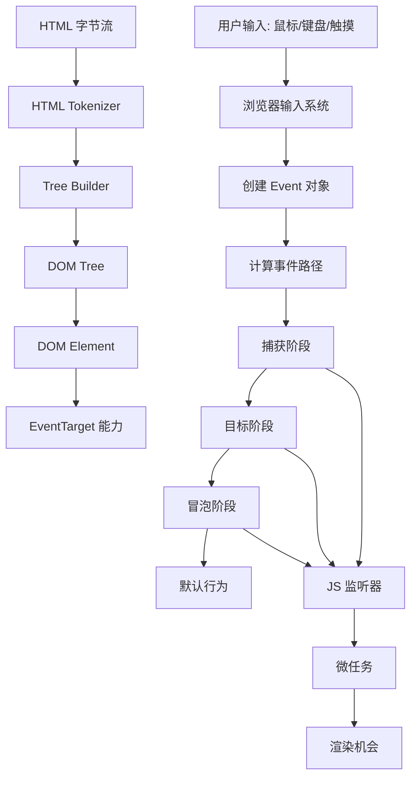
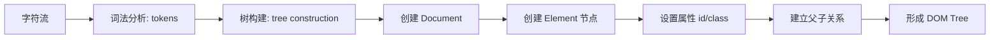
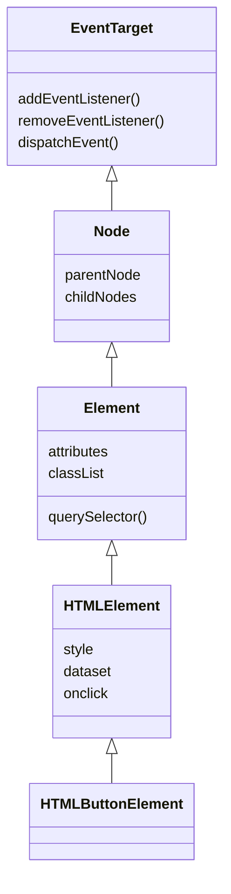
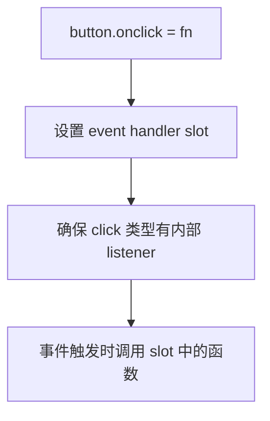
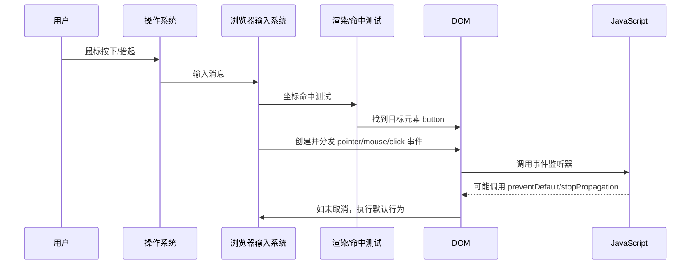
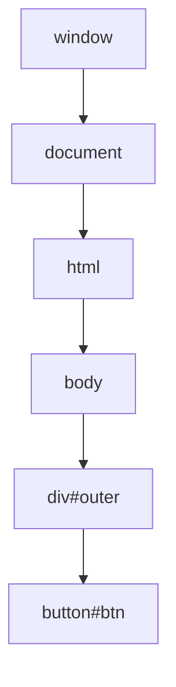
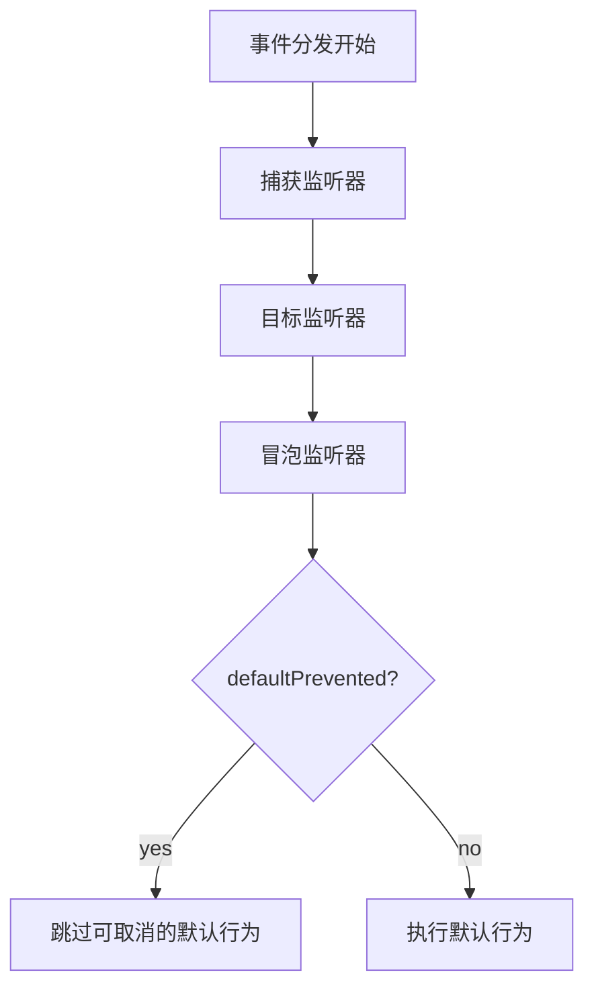
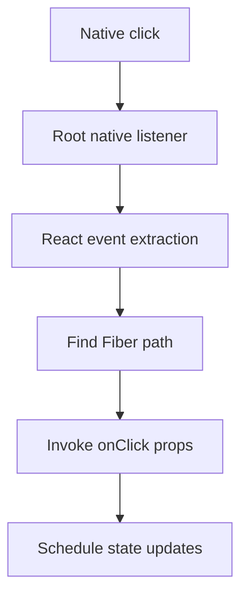
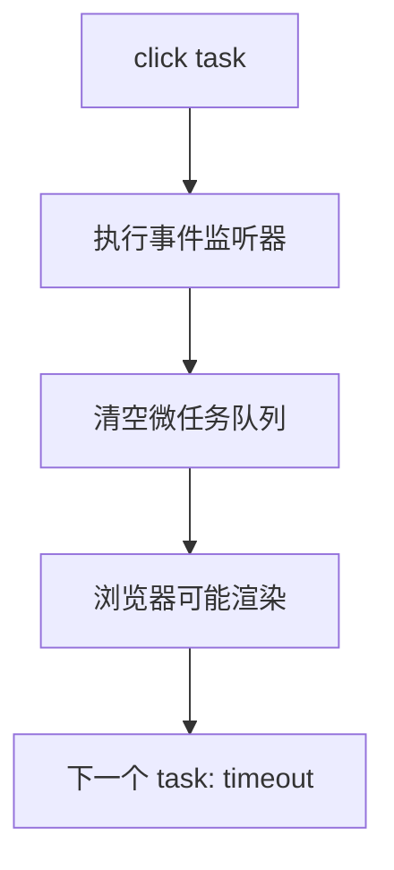
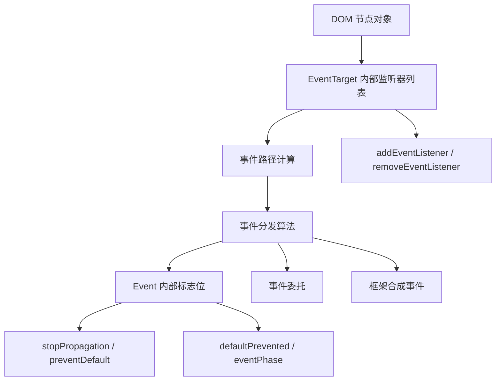

# JavaScript DOM 事件系统深度学习文档

本文档不是 API 速查表，而是一次从底层模型到工程实践的系统拆解。目标是回答这些问题：

- HTML 是如何一步一步变成 DOM 元素的？
- DOM 元素为什么可以监听事件？
- `onclick` 属性背后到底是什么？
- 浏览器内部如何分发一个事件？
- 捕获、目标、冒泡阶段是怎么计算出来的？
- 默认行为和事件传播是什么关系？
- 开发者能把事件系统改造到什么程度？
- 原生事件系统和 React、Vue 的事件系统是什么关系？

你可以把它当作《JavaScript 高级程序设计》DOM 事件章节的深度补充。

---

## 1. 先建立一张总图

DOM 事件系统不是孤立的。它连接了 HTML 解析、DOM 树、浏览器输入系统、事件循环、渲染管线和 JavaScript 执行环境。



对应的简化文字版：

```txt
HTML -> DOM Tree -> Element -> EventTarget

用户操作 -> 浏览器创建事件 -> 计算传播路径
        -> 捕获 -> 目标 -> 冒泡
        -> 监听器执行
        -> 默认行为
        -> 微任务/渲染
```

你需要把 DOM 事件理解成浏览器平台的一套“对象间通知和行为协调机制”，而不是简单的“点一下执行函数”。

---

## 2. DOM 元素是怎么一步一步组装出来的

### 2.1 从 HTML 到 DOM

假设有一段 HTML：

```html
<div id="app">
  <button class="primary">Save</button>
</div>
```

浏览器大致会经历这些步骤：



更具体一点：

```txt
1. 网络或本地文件提供 HTML 字节。
2. 浏览器按编码把字节解码成字符。
3. HTML tokenizer 把字符切成 token。
4. tree builder 根据 token 创建节点。
5. 创建 Document、Element、Text 等对象。
6. 设置元素属性，比如 id、class、href、onclick。
7. 把节点按嵌套关系插入 DOM 树。
8. DOM 树成为 JS 可以访问的对象图。
```

DOM 不是字符串结构，而是一组对象组成的树。

```txt
Document
└── html
    └── body
        └── div#app
            └── button.primary
                └── Text("Save")
```

### 2.2 一个 DOM 元素内部可以粗略理解成什么

真实浏览器实现很复杂，不同浏览器也不同。为了学习，可以用一个概念模型理解：

```js
const elementLike = {
  nodeType: 1,
  nodeName: 'BUTTON',
  parentNode: div,
  childNodes: [],
  attributes: {
    class: 'primary'
  },
  style: CSSStyleDeclaration,
  dataset: DOMStringMap,
  classList: DOMTokenList,
  eventListenerList: [],
  onclick: null
};
```

这不是浏览器源码，只是帮助你建立对象模型：

```txt
DOM Element =
  Node 能力
  + Element 能力
  + HTMLElement 能力
  + 具体元素能力，比如 HTMLButtonElement
  + EventTarget 能力
```

从继承关系上看，可以近似理解为：



重点：元素能监听事件，不是因为它是 `button`，而是因为它最终继承或实现了 `EventTarget`。

---

## 3. EventTarget：事件能力的核心

### 3.1 三个方法

几乎所有事件机制都围绕这三个方法：

```js
target.addEventListener(type, callback, options);
target.removeEventListener(type, callback, options);
target.dispatchEvent(event);
```

概念上，每个 `EventTarget` 内部都有一份监听器列表：

```js
const listenerRecord = {
  type: 'click',
  callback: handleClick,
  capture: false,
  passive: false,
  once: false,
  signal: null,
  removed: false
};
```

一个元素可以有多条监听记录：

```txt
button.[[eventListeners]]
├── { type: "click", callback: A, capture: true }
├── { type: "click", callback: B, capture: false }
├── { type: "input", callback: C, capture: false }
└── { type: "click", callback: D, once: true }
```

### 3.2 addEventListener 背后的概念步骤

当你写：

```js
button.addEventListener('click', handleClick, {
  capture: false,
  once: true,
  passive: true
});
```

浏览器概念上会做：

```txt
1. 读取事件类型 click。
2. 检查 callback 是否为 null。
3. 解析 options：
   capture = false
   once = true
   passive = true
4. 检查监听器列表里是否已经有同类型、同 callback、同 capture 的记录。
5. 如果没有重复记录，则追加一条 listener record。
6. 如果传了 signal，则在 signal abort 时移除这条监听器。
```

注意去重关键通常是：

```txt
type + callback + capture
```

所以这两个通常会被认为是重复监听：

```js
button.addEventListener('click', handleClick, { passive: true });
button.addEventListener('click', handleClick, { passive: false });
```

因为 `type`、`callback`、`capture` 相同，`passive` 不参与常规移除匹配。

### 3.3 removeEventListener 为什么经常失败

失败示例：

```js
button.addEventListener('click', function () {
  console.log('click');
});

button.removeEventListener('click', function () {
  console.log('click');
});
```

看起来一样，但这是两个函数对象：

```txt
FunctionObject#1 !== FunctionObject#2
```

正确做法：

```js
function handleClick() {
  console.log('click');
}

button.addEventListener('click', handleClick);
button.removeEventListener('click', handleClick);
```

还要匹配 `capture`：

```js
button.addEventListener('click', handleClick, { capture: true });
button.removeEventListener('click', handleClick, { capture: true });
```

---

## 4. onclick 属性背后是如何运作的

### 4.1 三种写法不是一回事

```html
<button onclick="save()">Save</button>
```

```js
button.onclick = function () {
  save();
};
```

```js
button.addEventListener('click', function () {
  save();
});
```

它们最后都能响应点击，但底层语义不同。

### 4.2 onclick 是事件处理器 IDL 属性

`onclick` 是 DOM 对象上的一个属性，通常称为事件处理器属性。

```js
console.log(button.onclick);

button.onclick = function (event) {
  console.log(event.type);
};
```

它可以理解成一个“特殊的单槽位事件监听器”：

```txt
button.onclick
  null 或 一个函数
```

当你赋值：

```js
button.onclick = handlerA;
button.onclick = handlerB;
```

第二次会覆盖第一次。

```txt
onclick slot:
  before: handlerA
  after:  handlerB
```

而 `addEventListener` 是追加：

```txt
listener list:
  handlerA
  handlerB
  handlerC
```

### 4.3 onclick 属性和 addEventListener 的关系

概念上，浏览器可能把 `onclick` 包装成内部事件监听器。



简化伪代码：

```js
Object.defineProperty(HTMLElement.prototype, 'onclick', {
  get() {
    return this.__eventHandlerSlots.click ?? null;
  },
  set(value) {
    if (typeof value === 'function' || value === null) {
      this.__eventHandlerSlots.click = value;
      ensureInternalEventHandlerListener(this, 'click');
    }
  }
});
```

再简化一点，事件触发时类似：

```js
function internalOnClickListener(event) {
  const handler = event.currentTarget.onclick;

  if (typeof handler === 'function') {
    const returnValue = handler.call(event.currentTarget, event);

    if (returnValue === false) {
      event.preventDefault();
    }
  }
}
```

注意：这是教学用伪代码，不是浏览器源码。

### 4.4 为什么 onclick 里的 this 是元素

```js
button.onclick = function (event) {
  console.log(this === button); // true
};
```

因为浏览器调用事件处理器时，会把 `this` 绑定为当前事件目标，也就是 `currentTarget`。

近似：

```js
handler.call(element, event);
```

但如果你使用箭头函数：

```js
button.onclick = (event) => {
  console.log(this);
};
```

箭头函数没有自己的 `this`，因此不会得到元素作为 `this`。

### 4.5 HTML 内联 onclick 背后发生了什么

```html
<button onclick="console.log(event); save()">Save</button>
```

浏览器解析到 `onclick` 内容属性时，会把字符串变成一个事件处理函数。概念上类似：

```js
button.onclick = function (event) {
  console.log(event);
  save();
};
```

但内联事件处理器有一些特殊作用域规则，历史包袱较重。不要在现代工程里依赖这种写法。

内联事件处理器的缺点：

- JS 和 HTML 混在一起。
- 不利于模块化。
- 受 CSP 限制。
- 字符串代码不利于工具分析。
- 作用域规则有历史复杂性。

### 4.6 return false 的真实含义

在 DOM0 或内联处理器中：

```html
<a href="/home" onclick="return false">Home</a>
```

或者：

```js
link.onclick = function () {
  return false;
};
```

`return false` 通常等价于阻止默认行为：

```js
event.preventDefault();
```

但它不等价于：

```js
event.stopPropagation();
```

在 `addEventListener` 中，返回 `false` 没有这个特殊效果：

```js
link.addEventListener('click', function () {
  return false; // 基本没有阻止默认行为的意义
});
```

现代代码应明确写：

```js
event.preventDefault();
event.stopPropagation();
```

---

## 5. 一个事件在浏览器内部如何运作

### 5.1 从物理输入到 DOM 事件

以点击按钮为例：



对应文字过程：

```txt
1. 用户产生物理输入。
2. 操作系统把输入消息交给浏览器。
3. 浏览器根据坐标、布局、层叠、可见性做命中测试。
4. 浏览器确定事件目标元素。
5. 浏览器创建事件对象，比如 PointerEvent、MouseEvent。
6. 浏览器计算事件路径。
7. 浏览器按捕获、目标、冒泡调用监听器。
8. 监听器可能改变事件状态。
9. 浏览器决定是否执行默认行为。
10. 当前任务结束后处理微任务，并进入渲染机会。
```

### 5.2 命中测试不是简单查 DOM

点击坐标 `(x, y)` 后，浏览器不是直接在 DOM 树里找最后一个元素，而是结合渲染结果做命中测试。

影响命中测试的因素：

- 元素布局位置。
- 元素尺寸。
- 层叠上下文。
- `z-index`。
- `pointer-events`。
- 可见性。
- transform 后的位置。
- iframe 或 Shadow DOM 边界。

例如：

```css
.overlay {
  position: fixed;
  inset: 0;
  z-index: 999;
}
```

即使按钮在 DOM 上更靠后，点击也可能先命中 `.overlay`。

再例如：

```css
.mask {
  pointer-events: none;
}
```

这个元素视觉上盖在上面，但鼠标事件可能穿透它。

---

## 6. 事件分发算法的概念模型

### 6.1 计算事件路径

假设 DOM 是：

```html
<body>
  <div id="outer">
    <button id="btn">Save</button>
  </div>
</body>
```

点击按钮时，路径近似为：

```txt
window
document
html
body
div#outer
button#btn
```

可视化：



分发方向：

```txt
捕获阶段：
window -> document -> html -> body -> div#outer

目标阶段：
button#btn

冒泡阶段：
div#outer -> body -> html -> document -> window
```

### 6.2 分发算法伪代码

教学版伪代码：

```js
function dispatchEvent(target, event) {
  if (event.isDispatching) {
    throw new Error('event is already being dispatched');
  }

  event.target = target;
  event.isDispatching = true;

  const path = buildEventPath(target);

  // 捕获阶段：从根到目标父级
  event.eventPhase = Event.CAPTURING_PHASE;
  for (const currentTarget of path.fromRootToTargetParent()) {
    invokeListeners(currentTarget, event, { capture: true });
    if (event.propagationStopped) break;
  }

  // 目标阶段
  if (!event.propagationStopped) {
    event.eventPhase = Event.AT_TARGET;
    event.currentTarget = target;

    invokeListeners(target, event, { capture: true });
    invokeListeners(target, event, { capture: false });
  }

  // 冒泡阶段
  if (event.bubbles && !event.propagationStopped) {
    event.eventPhase = Event.BUBBLING_PHASE;

    for (const currentTarget of path.fromTargetParentToRoot()) {
      invokeListeners(currentTarget, event, { capture: false });
      if (event.propagationStopped) break;
    }
  }

  event.eventPhase = Event.NONE;
  event.currentTarget = null;
  event.isDispatching = false;

  return !event.defaultPrevented;
}
```

这段伪代码省略了 Shadow DOM、slot、retargeting、activation behavior 等复杂细节，但主干是准确的。

### 6.3 invokeListeners 做了什么

伪代码：

```js
function invokeListeners(currentTarget, event, options) {
  event.currentTarget = currentTarget;

  const listeners = currentTarget.__listeners
    .filter((listener) => {
      return listener.type === event.type &&
        listener.capture === options.capture &&
        !listener.removed;
    });

  for (const listener of listeners) {
    if (event.immediatePropagationStopped) break;

    if (listener.once) {
      listener.removed = true;
    }

    try {
      listener.callback.call(currentTarget, event);
    } catch (error) {
      reportError(error);
    }
  }
}
```

几个关键点：

- 监听器按照注册顺序执行。
- `once` 监听器调用前后会被标记移除。
- `stopImmediatePropagation()` 会阻止当前目标上的后续监听器。
- 监听器抛错不会让异常像普通函数调用一样返回给 `dispatchEvent()` 调用者，而是通常被浏览器报告。
- 事件分发过程中修改监听器列表，会受到快照和 removed 标记影响，不能简单按数组直觉理解。

---

## 7. 事件对象内部状态

一个 `Event` 对象可以粗略理解成：

```js
const eventLike = {
  type: 'click',
  target: button,
  currentTarget: null,
  eventPhase: 0,
  bubbles: true,
  cancelable: true,
  defaultPrevented: false,
  isTrusted: true,
  timeStamp: 123456,

  stopPropagationFlag: false,
  stopImmediatePropagationFlag: false,
  canceledFlag: false,
  inPassiveListenerFlag: false,
  dispatchFlag: false
};
```

对应方法本质上是在改变内部标志位：

```js
event.stopPropagation();
// stopPropagationFlag = true

event.stopImmediatePropagation();
// stopPropagationFlag = true
// stopImmediatePropagationFlag = true

event.preventDefault();
// 如果 cancelable 且不在 passive listener 中：
// canceledFlag = true
// defaultPrevented = true
```

这解释了一个重要事实：

> 事件对象不是单纯的数据包，它是一次事件分发过程中的状态机。

---

## 8. 默认行为：事件之外的另一套机制

### 8.1 点击链接时发生了什么

```html
<a href="/profile">Profile</a>
```

点击链接不是“click 事件让页面跳转”。更准确是：

```txt
1. 浏览器分发 click 事件。
2. 如果事件没有被取消，执行 a 元素的默认激活行为。
3. 默认激活行为触发导航。
```

所以：

```js
link.addEventListener('click', function (event) {
  event.preventDefault();
});
```

阻止的是默认导航，不是阻止 click 事件发生。

### 8.2 常见默认行为

```txt
<a> click        -> 导航
<button> click   -> 激活按钮
submit button    -> 提交表单
checkbox click   -> 切换 checked
input keydown    -> 输入文本或控制光标
wheel            -> 滚动
contextmenu      -> 打开右键菜单
dragstart        -> 开始拖拽
```

### 8.3 默认行为和传播的关系



`stopPropagation()` 只影响传播路径，不等价于取消默认行为。

```js
link.addEventListener('click', function (event) {
  event.stopPropagation();
});
```

链接仍然可能跳转。

`preventDefault()` 只影响默认行为，不等价于阻止传播。

```js
link.addEventListener('click', function (event) {
  event.preventDefault();
});
```

外层监听器仍然可能收到 click。

---

## 9. 捕获、目标、冒泡的细节

### 9.1 目标阶段不是冒泡阶段

```js
button.addEventListener(
  'click',
  function (event) {
    console.log('capture on target', event.eventPhase);
  },
  { capture: true }
);

button.addEventListener('click', function (event) {
  console.log('bubble on target', event.eventPhase);
});
```

点击 `button` 时，两个监听器都在目标阶段执行：

```txt
event.eventPhase === Event.AT_TARGET
```

只是捕获监听器通常先于非捕获监听器执行。

### 9.2 不是所有事件都冒泡

例如：

```txt
focus       不冒泡
blur        不冒泡
mouseenter 不冒泡
mouseleave 不冒泡
load        通常不按普通方式冒泡
```

替代方案：

```txt
focusin     冒泡
focusout    冒泡
mouseover   冒泡
mouseout    冒泡
```

### 9.3 target 和 currentTarget 的动态关系

```txt
target:
  本次事件的原始目标，通常不随监听器变化。

currentTarget:
  当前正在执行监听器的 EventTarget，会随着传播过程变化。
```

图示：

```txt
点击 button

body listener:
  target        = button
  currentTarget = body

outer listener:
  target        = button
  currentTarget = outer

button listener:
  target        = button
  currentTarget = button
```

事件委托就是利用这个差异。

---

## 10. Shadow DOM 让事件复杂在哪里

### 10.1 事件重定向

Shadow DOM 的目标是封装组件内部结构，因此外部监听器不一定能看到真实内部节点。

```txt
<my-button>
  #shadow-root
    <button>Save</button>
</my-button>
```

点击内部 `button`：

```txt
组件内部看到：
event.target -> button

组件外部看到：
event.target -> my-button
```

这叫 retargeting，事件目标重定向。

### 10.2 composed 决定是否穿过 Shadow 边界

自定义事件默认不会自动穿过 Shadow DOM 边界。

```js
this.dispatchEvent(
  new CustomEvent('select', {
    bubbles: true,
    composed: true,
    detail: { value: 'js' }
  })
);
```

三个字段要分清：

```txt
bubbles:
  是否向祖先冒泡。

composed:
  是否允许穿过 Shadow DOM 边界。

cancelable:
  是否允许 preventDefault() 取消。
```

### 10.3 composedPath

```js
element.addEventListener('click', function (event) {
  console.log(event.composedPath());
});
```

`composedPath()` 比 `target` 更接近真实传播路径，适合调试 Shadow DOM 事件问题。

---

## 11. 开发者能对事件系统改造到什么程度

### 11.1 可以做的事情

你可以：

```txt
1. 添加、移除、批量清理监听器。
2. 选择捕获阶段或冒泡阶段。
3. 使用 once 控制一次性监听。
4. 使用 passive 优化滚动。
5. 使用 AbortController 管理生命周期。
6. 调用 stopPropagation 改变传播。
7. 调用 stopImmediatePropagation 阻断后续监听器。
8. 调用 preventDefault 取消可取消的默认行为。
9. 创建并分发自定义事件。
10. 使用事件委托重塑事件处理结构。
11. monkey patch addEventListener 做日志、埋点、调试。
12. 在框架层实现合成事件系统。
13. 用 Pointer Capture 改变指针事件后续目标。
```

### 11.2 不能做或不应依赖的事情

你不能可靠地：

```txt
1. 创建 isTrusted 为 true 的用户事件。
2. 绕过浏览器安全限制执行受保护默认行为。
3. 完全替换浏览器原生事件分发算法。
4. 伪造真实文件选择、剪贴板授权、全屏授权等用户激活行为。
5. 让所有默认行为都可取消。
6. 假设所有事件都会冒泡。
7. 假设事件路径只等于普通 DOM parentNode 链。
8. 假设不同浏览器内部实现完全一致。
```

### 11.3 monkey patch addEventListener

你可以包装原生方法：

```js
const rawAddEventListener = EventTarget.prototype.addEventListener;

EventTarget.prototype.addEventListener = function (type, listener, options) {
  console.log('add listener:', {
    target: this,
    type,
    listener,
    options
  });

  return rawAddEventListener.call(this, type, listener, options);
};
```

这可以用于：

- 调试事件绑定。
- 做性能分析。
- 检测重复监听。
- 统一埋点。
- 框架或测试工具增强。

但风险很高：

- 影响全局行为。
- 可能破坏第三方库。
- 可能改变函数身份和移除逻辑。
- 性能成本不可忽略。

工程中除非你在写框架、监控 SDK 或调试工具，否则不建议这样做。

### 11.4 用事件委托改造事件处理结构

原始写法：

```js
document.querySelectorAll('.delete-button').forEach((button) => {
  button.addEventListener('click', handleDelete);
});
```

委托写法：

```js
list.addEventListener('click', function (event) {
  const button = event.target.closest('.delete-button');

  if (!button) return;
  if (!list.contains(button)) return;

  handleDelete(button);
});
```

这不是改变浏览器事件系统，而是利用冒泡机制重新组织应用代码。

### 11.5 自定义事件系统

你可以基于 `EventTarget` 做自己的事件总线：

```js
class Store extends EventTarget {
  setState(nextState) {
    this.state = nextState;

    this.dispatchEvent(
      new CustomEvent('change', {
        detail: nextState
      })
    );
  }
}
```

使用：

```js
const store = new Store();

store.addEventListener('change', function (event) {
  console.log(event.detail);
});

store.setState({ count: 1 });
```

这种方式适合小型模块通信，但大型应用要谨慎，避免数据流变得隐式。

---

## 12. 框架如何“改造”事件系统

### 12.1 React 的思路

React 并不是简单把：

```jsx
<button onClick={handleClick} />
```

直接变成：

```js
button.onclick = handleClick;
```

更接近的理解是：

```txt
React 根节点绑定少量原生监听器
        ↓
原生事件冒泡到根节点
        ↓
React 根据 Fiber 树找到组件监听器
        ↓
构造或包装事件对象
        ↓
按框架自己的规则调用 props.onClick
        ↓
触发状态更新和调度
```

图示：



这类系统通常叫合成事件或框架事件层。

### 12.2 Vue 的思路

Vue 模板：

```vue
<button @click.stop.prevent="save">Save</button>
```

可以理解为编译成类似：

```js
button.addEventListener('click', function (event) {
  event.stopPropagation();
  event.preventDefault();
  save(event);
});
```

事件修饰符本质是对原生事件 API 的声明式封装：

```txt
.stop     -> stopPropagation()
.prevent  -> preventDefault()
.capture  -> { capture: true }
.once     -> { once: true }
.passive  -> { passive: true }
```

---

## 13. 点击事件的完整生命周期案例

HTML：

```html
<form id="form" action="/save">
  <button id="btn" type="submit">Save</button>
</form>
```

监听：

```js
document.addEventListener(
  'click',
  function () {
    console.log('document capture');
  },
  { capture: true }
);

form.addEventListener('click', function () {
  console.log('form bubble');
});

btn.onclick = function () {
  console.log('button onclick');
};

btn.addEventListener('click', function (event) {
  console.log('button addEventListener');
});

form.addEventListener('submit', function (event) {
  event.preventDefault();
  console.log('form submit');
});
```

点击按钮后，大致过程：

```txt
1. 操作系统传入点击消息。
2. 浏览器命中测试找到 button。
3. 浏览器创建 click 事件。
4. 计算路径：window -> document -> html -> body -> form -> button。
5. 捕获阶段调用 document capture。
6. 目标阶段调用 button 上的 onclick 内部监听器和 addEventListener 监听器。
7. 冒泡阶段调用 form bubble。
8. button 的默认激活行为触发表单提交。
9. 浏览器创建 submit 事件。
10. form submit 监听器调用 preventDefault。
11. 表单默认导航提交被取消。
```

这里要注意：

```txt
click 事件和 submit 事件是两个事件。
button 的默认行为可能导致 submit 事件。
submit 事件的 preventDefault 阻止的是表单提交默认行为。
```

---

## 14. 深入理解 passive

滚动相关事件有一个性能问题。

```js
window.addEventListener('touchmove', function (event) {
  event.preventDefault();
});
```

浏览器在滚动前需要等待 JS 执行，因为 JS 可能会取消滚动。

```txt
touchmove 到达
  ↓
浏览器问：JS 会不会 preventDefault？
  ↓
执行监听器
  ↓
如果没取消，开始滚动
```

如果你声明：

```js
window.addEventListener('touchmove', handleMove, {
  passive: true
});
```

就等于告诉浏览器：

```txt
这个监听器不会取消默认滚动。
```

浏览器就可以更积极地处理滚动。

但在 passive 监听器里：

```js
event.preventDefault();
```

会被忽略。

---

## 15. Pointer Capture：少见但很有深度

拖拽时有一个问题：指针按下后，如果移动到元素外，后续 `pointermove` 可能不再发给原元素。

Pointer Capture 可以改变这一点：

```js
slider.addEventListener('pointerdown', function (event) {
  slider.setPointerCapture(event.pointerId);
});

slider.addEventListener('pointermove', function (event) {
  if (event.buttons !== 1) return;
  updateSlider(event.clientX);
});

slider.addEventListener('pointerup', function (event) {
  slider.releasePointerCapture(event.pointerId);
});
```

概念图：

```txt
pointerdown on slider
        ↓
setPointerCapture(pointerId)
        ↓
后续 pointermove/pointerup 优先派发给 slider
        ↓
releasePointerCapture(pointerId)
```

它不是取消事件系统，而是请求浏览器改变某个指针流的目标分配。

---

## 16. 事件和事件循环

事件监听器执行在 JavaScript 主线程中。

```js
button.addEventListener('click', function () {
  console.log('click');

  Promise.resolve().then(function () {
    console.log('microtask');
  });

  setTimeout(function () {
    console.log('timeout');
  }, 0);
});
```

输出：

```txt
click
microtask
timeout
```

简化流程：



如果监听器里有长任务：

```js
button.addEventListener('click', function () {
  const start = Date.now();

  while (Date.now() - start < 3000) {}
});
```

页面会在这段时间里不能响应新的输入，也不能正常渲染。

---

## 17. 实验：自己观察内部机制

### 17.0 可运行 demo：MyEventTarget

工作区里新增了一个可直接打开的示例：

```txt
my-event-target-demo.html
```

文件已拆分为：

```txt
my-event-target-demo.html
  页面入口，只保留 HTML 结构和资源引用。

my-event-target-demo/styles.css
  页面样式。

my-event-target-demo/app.js
  MyEvent、MyEventTarget、分发算法和 demo 初始化逻辑。
```

它用教学代码模拟了一套极简事件系统：

```txt
MyEventTarget
  addEventListener()
  removeEventListener()
  dispatchEvent()

MyEvent
  target
  currentTarget
  eventPhase
  defaultPrevented
  stopPropagation()
  stopImmediatePropagation()
  preventDefault()
```

这个 demo 重点观察：

```txt
1. 每个 EventTarget 内部维护 listener record 列表。
2. dispatchEvent 会构造事件路径。
3. 捕获、目标、冒泡阶段只是分发算法的不同循环。
4. once 本质是调用后把 listener record 标记为 removed。
5. passive 本质是让 preventDefault() 在当前监听器内失效。
6. AbortSignal 本质是外部触发移除监听器记录。
7. dispatchEvent 返回值由 defaultPrevented 推导出来。
```

它不是浏览器源码复刻，而是用较少代码把事件系统的底层结构显性化。

#### MyEventTarget demo 调用过程图

初始化阶段：

```txt
new MyEventTarget('root')
        ↓
new MyEventTarget('parent')
        ↓
parent.appendTo(root)
        ↓
new MyEventTarget('child')
        ↓
child.appendTo(parent)
```

形成一棵极简的“模拟 DOM 树”：

```txt
root
└── parent
    └── child
```

内部对象关系：

```txt
root
  parent = null

parent
  parent = root

child
  parent = parent
```

注册监听器阶段：

```txt
root.addEventListener('save', rootCapture, { capture: true })
        ↓
root._listeners.push(listenerRecord)

parent.addEventListener('save', parentCapture, { capture: true })
        ↓
parent._listeners.push(listenerRecord)

child.addEventListener('save', childHandler)
        ↓
child._listeners.push(listenerRecord)
```

每个节点内部都有自己的监听器表：

```txt
root._listeners
├── save / capture=true
└── save / capture=false

parent._listeners
├── save / capture=true
├── save / capture=false
└── save / signal

child._listeners
├── save / capture=false
├── save / once=true
└── save / passive=true
```

点击页面按钮时，真实 DOM 只负责启动 demo：

```txt
用户点击页面按钮
        ↓
浏览器触发真实 click
        ↓
执行按钮 click 监听器
        ↓
child.dispatchEvent(new MyEvent('save', ...))
```

从这一刻开始，进入的是我们自己写的 `MyEventTarget` 事件系统。

`dispatchEvent()` 内部流程：

```txt
child.dispatchEvent(event)
        ↓
event.target = child
        ↓
buildPath(child)
        ↓
得到路径 child -> parent -> root
        ↓
反转祖先路径 root -> parent
        ↓
进入捕获阶段
        ↓
进入目标阶段
        ↓
进入冒泡阶段
        ↓
返回 !event.defaultPrevented
```

展开看：

```txt
dispatchEvent(event)
│
├─ 1. 设置 event.target
│      event.target = child
│
├─ 2. 构建事件路径
│      child -> parent -> root
│
├─ 3. 捕获阶段
│      root   capture listener
│      parent capture listener
│
├─ 4. 目标阶段
│      child capture listeners
│      child bubble listeners
│
├─ 5. 冒泡阶段
│      parent bubble listener
│      root   bubble listener
│
└─ 6. 结束
       return !event.defaultPrevented
```

事件流方向：

```txt
捕获阶段
root
 ↓
parent
 ↓
child   ← 目标阶段
 ↑
parent
 ↑
root
冒泡阶段
```

对应执行顺序：

```txt
root capture
  ↓
parent capture
  ↓
child target listeners
  ↓
parent bubble
  ↓
root bubble
```

`target` 和 `currentTarget` 的变化：

```txt
event.target 永远是 child
```

但 `event.currentTarget` 会随着当前执行的监听器变化：

```txt
执行 root 监听器时：
target        = child
currentTarget = root

执行 parent 监听器时：
target        = child
currentTarget = parent

执行 child 监听器时：
target        = child
currentTarget = child
```

图示：

```txt
root listener
  event.target        ─────┐
  event.currentTarget ─ root│
                            │
parent listener             │
  event.target        ─────┤── child
  event.currentTarget ─ parent
                            │
child listener              │
  event.target        ─────┘
  event.currentTarget ─ child
```

`preventDefault()` 如何影响返回值：

```txt
child listener
        ↓
event.preventDefault()
        ↓
event.defaultPrevented = true
        ↓
dispatchEvent 结束
        ↓
return false
```

原因是 demo 里的 `dispatchEvent()` 最终返回：

```js
return !event.defaultPrevented;
```

这和原生 DOM 的 `dispatchEvent()` 返回值模型一致：如果可取消事件被取消，返回 `false`；否则返回 `true`。

### 17.1 打印完整事件路径

```html
<div id="outer">
  <button id="btn">Save</button>
</div>

<script>
  document.addEventListener('click', function (event) {
    console.log(
      event.composedPath().map(function (node) {
        return node.nodeName || String(node);
      })
    );
  });
</script>
```

### 17.2 观察 listener 顺序

```js
button.onclick = function () {
  console.log('onclick');
};

button.addEventListener('click', function () {
  console.log('listener A');
});

button.addEventListener('click', function () {
  console.log('listener B');
});
```

思考：

- `onclick` 和 `addEventListener` 的相对顺序是否符合你的预期？
- 如果先写 `addEventListener`，再写 `onclick`，顺序是否变化？
- 不同浏览器中是否应该依赖这种细节？

工程建议：不要依赖 DOM0 处理器和 DOM2 监听器之间的细微顺序，统一使用 `addEventListener` 更清晰。

### 17.3 观察默认行为

```html
<a id="link" href="https://example.com">Example</a>

<script>
  link.addEventListener('click', function (event) {
    console.log('cancelable:', event.cancelable);
    console.log('before:', event.defaultPrevented);

    event.preventDefault();

    console.log('after:', event.defaultPrevented);
  });
</script>
```

### 17.4 观察 passive

```js
window.addEventListener(
  'wheel',
  function (event) {
    console.log('cancelable:', event.cancelable);
    event.preventDefault();
  },
  { passive: true }
);
```

观察控制台警告，并思考为什么浏览器要忽略 `preventDefault()`。

---

## 18. 你应该形成的深层认知

### 18.1 真正的学习顺序：从底层推演上层

学习 DOM 事件时，最容易走偏的方式是先背 API：

```txt
addEventListener 怎么用
stopPropagation 怎么用
preventDefault 怎么用
事件委托怎么写
```

这会让知识变成孤立结论。更扎实的顺序应该是：

```txt
平台对象模型
  ↓
DOM 树和事件路径
  ↓
监听器列表
  ↓
事件对象内部状态
  ↓
事件分发算法
  ↓
默认行为机制
  ↓
上层 API 和工程模式
```

也就是说，上层 API 是底层机制的外露接口。



### 18.2 从内部结构推演 addEventListener

如果你先假设每个 `EventTarget` 内部有一张监听器表：

```txt
EventTarget.[[listeners]]
├── listener record
├── listener record
└── listener record
```

每条记录包含：

```txt
type
callback
capture
once
passive
signal
removed
```

那么就能自然推演出：

```txt
addEventListener(type, callback, options)
  = 往监听器表中添加一条 listener record。

removeEventListener(type, callback, options)
  = 从监听器表中找到匹配记录并标记移除。

once: true
  = 调用后自动把 listener record 标记为 removed。

passive: true
  = 调用监听器时设置 inPassiveListenerFlag，
    从而让 preventDefault() 无效。

signal
  = signal abort 时自动移除关联 listener record。
```

这样你不需要死记这些选项，它们都是监听器记录字段的外部表达。

### 18.3 从事件对象状态推演 stopPropagation

如果一个事件对象内部有这些标志位：

```txt
stopPropagationFlag
stopImmediatePropagationFlag
canceledFlag
inPassiveListenerFlag
dispatchFlag
```

那么这些方法就很好理解：

```txt
stopPropagation()
  -> 设置 stopPropagationFlag
  -> 分发算法在进入下一个节点前检查它
  -> 如果为 true，就不再继续传播到后续节点

stopImmediatePropagation()
  -> 设置 stopPropagationFlag
  -> 设置 stopImmediatePropagationFlag
  -> 当前节点后续监听器也不再调用

preventDefault()
  -> 如果 cancelable 为 true 且不在 passive listener 中
  -> 设置 canceledFlag
  -> defaultPrevented 变成 true
  -> 分发结束后，浏览器跳过可取消默认行为
```

这解释了为什么：

```txt
stopPropagation 不会阻止链接跳转。
preventDefault 不会阻止事件冒泡。
stopImmediatePropagation 比 stopPropagation 更强。
passive 监听器里 preventDefault 会失效。
```

这些不是规则碎片，而是内部标志位不同导致的自然结果。

### 18.4 从事件路径推演事件委托

如果事件分发必须沿着路径走：

```txt
button -> li -> ul -> body -> document
```

那么父元素一定有机会收到子元素冒泡上来的事件。

于是自然得到事件委托：

```js
ul.addEventListener('click', function (event) {
  const button = event.target.closest('button');
  if (!button) return;

  handleButtonClick(button);
});
```

它不是一种“技巧”，而是事件路径和冒泡阶段的直接推论。

同样也能推演出它的限制：

```txt
如果事件不冒泡，委托就不能按普通方式工作。
如果 Shadow DOM retargeting 改变 target，委托判断要更谨慎。
如果事件被 stopPropagation 截断，上层委托监听器可能收不到。
```

### 18.5 从默认行为推演 preventDefault 的边界

如果默认行为是事件分发之后由浏览器决定是否执行的一组行为：

```txt
dispatch event
  ↓
检查 canceledFlag
  ↓
如果没有取消，执行默认行为
```

那么可以推演出：

```txt
preventDefault 只对 cancelable 的事件有效。
preventDefault 不是取消事件本身，而是取消后续默认行为。
不是所有浏览器行为都能被 preventDefault 取消。
被动监听器中 preventDefault 会被忽略。
```

例如：

```js
link.addEventListener('click', function (event) {
  event.preventDefault();
});
```

它不是让 click 消失，而是让 click 对应的导航默认行为不再发生。

### 18.6 从 onclick 单槽位推演它的局限

如果 `onclick` 是一个事件处理器属性槽：

```txt
HTMLElement.onclick -> function 或 null
```

那么它的表现就很自然：

```txt
button.onclick = A
button.onclick = B
```

结果只能保留 `B`。

因为它不是监听器列表，而是一个属性槽。

```txt
onclick:
  before -> A
  after  -> B
```

而 `addEventListener` 操作的是列表：

```txt
listeners:
  A
  B
  C
```

所以你可以推演出：

```txt
onclick 不适合多个模块共同监听。
onclick 不适合表达 once/passive/signal。
onclick 更像历史兼容接口。
addEventListener 才是现代事件模型的主要入口。
```

### 18.7 从用户激活模型推演安全边界

有些行为必须来自真实用户操作，例如：

```txt
打开文件选择框
读取剪贴板
进入全屏
自动播放有声媒体
弹窗
```

这类行为通常依赖浏览器内部的用户激活状态，而不是简单依赖某个事件对象。

所以即使你写：

```js
button.dispatchEvent(new MouseEvent('click', { bubbles: true }));
```

也不等于真实用户点击。

可以推演出：

```txt
脚本创建的事件 isTrusted 是 false。
脚本事件不能完全模拟真实用户授权。
浏览器安全能力不会只因为事件类型叫 click 就放行。
```

这就是为什么事件系统既开放又有边界。

---

### 18.8 事件不是函数调用，而是协议

普通函数调用：

```txt
caller -> function -> return
```

事件分发：

```txt
browser/framework -> event path -> listeners -> flags -> default action
```

它是一套参与者很多的协议。

### 18.9 DOM 元素不是静态标签，而是平台对象

HTML 中的：

```html
<button onclick="save()">Save</button>
```

最终会变成一个拥有属性、方法、内部槽、事件监听器列表和默认行为的平台对象。

### 18.10 onclick 是历史友好接口，不是现代事件模型的上限

`onclick` 简单，但表达能力有限：

- 只能一个处理器。
- 不好管理捕获。
- 不支持 `once`、`passive`、`signal`。
- 不适合复杂生命周期。

现代工程应以 `addEventListener` 和框架事件系统为主。

### 18.11 事件改造有边界

你可以重组监听方式、包装 API、设计自定义事件、拦截默认行为，但不能把浏览器安全模型、用户激活模型和底层分发机制完全改写。

---

## 19. 复习问题

1. 一个 `<button>` 从 HTML 字符串到 DOM 对象，大致经历了哪些步骤？
2. 为什么 DOM 元素可以调用 `addEventListener`？
3. `onclick = fn` 和 `addEventListener('click', fn)` 在内部模型上有什么区别？
4. 内联 `onclick="..."` 为什么不适合作为现代工程写法？
5. 浏览器如何确定鼠标点击命中了哪个元素？
6. 事件路径是怎么来的？
7. `stopPropagation()` 改变了事件对象里的什么状态？
8. `preventDefault()` 为什么不等于停止冒泡？
9. 默认行为和事件分发是什么关系？
10. 为什么 `passive: true` 可以优化滚动？
11. 为什么脚本不能创建 `isTrusted: true` 的事件？
12. React 的 `onClick` 为什么不是简单的 DOM0 `onclick`？
13. Shadow DOM 中为什么外部看到的 `target` 可能不是内部真实节点？
14. 事件委托到底是改变浏览器机制，还是利用浏览器机制？
15. 你能用 `EventTarget` 自己实现一个小型状态事件系统吗？

---

## 20. 最后的一句话模型

如果要把 DOM 事件系统压缩成一句话：

> 浏览器把 HTML 解析成一棵由平台对象组成的 DOM 树，DOM 元素通过 `EventTarget` 获得事件能力；当用户输入或代码分发事件时，浏览器计算事件路径，按捕获、目标、冒泡阶段调用监听器，监听器通过修改事件对象的内部标志影响传播和默认行为；`onclick` 是历史遗留的单槽位事件处理器接口，而 `addEventListener`、自定义事件、事件委托和框架合成事件系统是在这套底层协议上的不同层次封装。

补充阅读：

```txt
event-flow-discussion-summary.md
```

这份补充文档保留了学习过程中的原始表述，并整理了“事件对象、事件路径、currentTarget、listener records、默认行为”之间的最终讨论结论。
